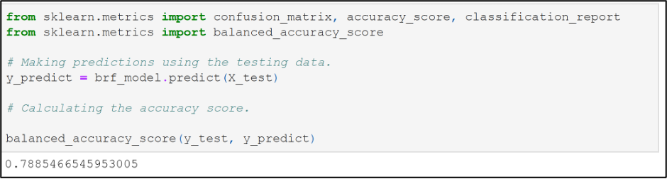

# Credit_Risk_Analysis

## Overview

This project uses Supervised Machine Learning to predict credit risk. The data is analyzed using 6 machine learning models and each model is assessed on how well it classifies and predicts data.

## Results
Six machine learning models are listed below. The balanced accuracy score and the precision and recall scores of each model will be presented. The balanced accuracy score indicates how likely a model is to label all the predictions correctly. The precision is a measure of how reliable a positive classification is. The recall is a measure of how likely the model is to find all positive classifications. 

**Naïve Random Oversampling**

* This model has a balanced accuracy score of 0.6547, meaning the model is predicting correctly 65.47% of the time.  

  

* The precision and recall for high risk are 0.01 and 0.72 respectively.  

* The precision and recall for low risk are 1.00 and 0.59, respectively.

  

**SMOTE Oversampling**

* This model has a balanced accuracy score of 0.6620, meaning the model is predicting correctly 66.2% of the time. 

  

* The precision and recall for high risk are 0.01 and 0.63, respectively.  

* The precision and recall for low risk are 1.00 and 0.69, respectively.
  
  
 
**Cluster Centroids Algorithm (Undersampling)**

* This model has a balanced accuracy score of 0.5447, meaning the model is predicting correctly 54.47% of the time. 

  

* The precision and recall for high risk are 0.01 and 0.69, respectively.  

* The precision and recall for low risk are 1.00 and 0.40, respectively.

  
 

**Combination of Over and Under Sampling**

* This model has a balanced accuracy score of 0.6473, meaning the model is predicting correctly 64.73% of the time.  

  

* The precision and recall for high risk are 0.01 and 0.72, respectively.  

* The precision and recall for low risk are 1.00 and 0.57, respectively.

  
 
**Balanced Random Forest Classifier**

* This model has a balanced accuracy score of 0.7885, meaning the model is predicting correctly 78.85% of the time.  

  

* The precision and recall for high risk are 0.03 and 0.70, respectively.  

* The precision and recall for low risk are 1.00 and 0.87, respectively.

  
 
**Easy Ensemble AdaBoost Classifier**

* This model has a balanced accuracy score of 0.9317, meaning the model is predicting correctly 93.17% of the time.  

  

* The precision and recall for high risk are 0.09 and 0.92, respectively.  

* The precision and recall for low risk are 1.00 and 0.94, respectively.

  

## Summary 

In terms of balanced accuracy, the Cluster Centroids Algorithm performed the worst while the Easy Ensemble AdaBoost Classifier performed the best. All of the models reveal a very low precision when determining if a credit risk is high, meaning that the all of the models are not reliable when identifying someone as high risk. In terms of recall for high risk, the AdaBoost classifier is again the highest at 92%. Thus, this model does the best job of identifying all the high risk applicants. Of all the models presented in this analysis, the AdaBoost Classifier, even with its low precision, in general does the best job of predicting a credit risk. I recommend this model with caution since the original data set was quite unbalanced with a very small number of applicants identified as high risk. 

